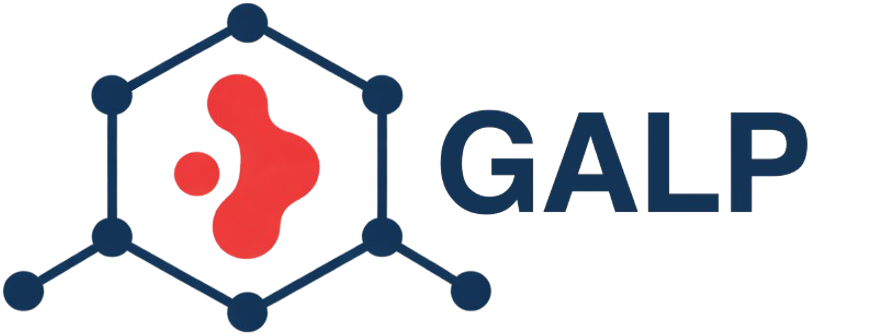

<a id="readme-top"></a>


[![Contributors][contributors-shield]][contributors-url]
[![Forks][forks-shield]][forks-url]
[![Stargazers][stars-shield]][stars-url]
[![Issues][issues-shield]][issues-url]

<br />
<div align="center">
  <a href="https://github.com/uowoolab/GALP/main/images/GALP.png">
    
  </a>

<h3 align="center">Guest Atom Localizer from Probabilities (GALP)</h3>

  <p align="center">
    GALP is an automated tool that identifies and fits guest binding sites from GCMC probability distributions in porous materials.
    <br />
    <a href="https://github.com/uowoolab/GALP/docs"><strong>Explore the docs »</strong></a>
    <br />
    <br />
    <a href="https://github.com/uowoolab/GALP/tree/main/examples">View Demo</a>
    &middot;
    <a href="https://github.com/uowoolab/GALP/issues/new?labels=bug&template=bug-report---.md">Report Bug</a>
    &middot;
    <a href="https://github.com/uowoolab/GALP/issues/new?labels=enhancement&template=feature-request---.md">Request Feature</a>
  </p>
</div>

## Authors and Contributions

- **Olivier Marchand** – *Master’s student, University of Ottawa*
  
Primary developer and maintainer of GALP. Responsible for algorithm design, implementation, testing and validation, and documentation.

- **Jake Burner** – *PhD student, University of Ottawa*

Developed a machine learning workflow using binding site maxima extracted with GALP and integrated an option to predict full atomic probability distributions without explicit GCMC simulations. Further details are available in: [J. Burner *et al.*, 2025](https://chemrxiv.org/engage/chemrxiv/article-details/68bf29fd23be8e43d6c7af1f).

### Original Creation Acknowledgment

- **Tom Burns**, *PhD*

Creator of the original legacy GALA vectorial binding site localization algorithm on which this work builds upon.

## About The Project

GALP is a binding site identification tool designed to extract chemically meaningful guest binding sites from Grand Canonical Monte Carlo (GCMC) probability distributions in porous materials such as metal organic frameworks (MOF). The algorithm operates on atomic probability distributions (APD) generated from GCMC simulations, applies Gaussian smoothing to suppress statistical noise, and identifies high probability regions as candidate binding sites. Using a reference molecular geometry from the guest force field model, GALP fits the guest molecule to each site via a recursive RMSD based alignment procedure.

Key parameters including occupancy cutoffs, exclusion radii, and the maximum number of binding sites are fully user adjustable, allowing the method to be adapted to a wide range of host guest systems. The resulting configurations are suitable for downstream analysis, including force field based energy minimization and quantum chemical calculations. GALP is fully automated, scalable, and designed for high throughput screening workflows.

A legacy version of the underlying binding site localization algorithm has previously been applied in the literature, notably in [Boyd *et al.*, Nature, 2019, 576, 7786](https://www.nature.com/articles/s41586-019-1798-7). The present implementation extends and generalizes this approach, with substantial improvements in automation, robustness, and applicability.

GALP currently supports APDs generated with both FastMC and RASPA. Example workflows for each GCMC engine are provided, along with dedicated documentation describing the required inputs, supported options, and recommended analysis procedures.

## Citation

If you use GALP in your work, please cite the software repository:

O. Marchand, J. Burner, *GALP: Guest Atom Localization from Probabilities*,  
GitHub repository, https://github.com/uowoolab/GALP

A peer reviewed manuscript describing GALP is currently in preparation. This citation will be updated upon publication.

## Getting Started

GALP supports both FastMC and RASPA based workflows and relies on a common set of core Python libraries. Additional dependencies required for the optional machine learning workflow are documented separately.

### Requirements

The following versions have been tested and are recommended for compatibility:

* Python 3.9.7
* numpy 1.20.3
* pymatgen 2023.8.10
* scipy 1.7.1

Install the core dependencies using pip:

```bash
pip install numpy==1.20.3 pymatgen==2023.8.10 scipy==1.7.1
```
or using conda:
```bash
conda install -c conda-forge numpy=1.20.3 pymatgen=2023.8.10 scipy=1.7.1
```

### Core Python Dependencies

GALP makes use of standard Python libraries and scientific packages for file handling, parallel execution, volumetric data processing, and numerical analysis.

**Standard library modules** include:

* file and process management: `os`, `shutil`, `subprocess`, `multiprocessing`, `glob`
* runtime and system utilities: `time`, `warnings`, `sys`, `logging`, `json`, `re`
* iteration and typing utilities: `itertools`, `typing`

**Third party scientific libraries** include:

* `numpy`
* `pymatgen` (structures, volumetric data, periodic boundary handling)
* `scipy` (Gaussian smoothing, morphological filters, statistical analysis)
* `rmsd` (alignment and RMSD calculations)

Dependencies specific to the machine learning based predictive workflow are documented separately in the corresponding section and are not required for standard GALP usage.

## Installation

1. Clone the repository:

   ```bash
   git clone https://github.com/uowoolab/GALP.git
   ```

2. Install the required Python dependencies:

   ```bash
   pip install numpy==1.20.3 pymatgen==2023.8.10 scipy==1.7.1
   ```

3. For convenience, you may make the main execution script executable:

   ```bash
   chmod +x GALP.py
   ```

## Usage

1. Prepare the input file according to the required specifications using your preferred text editor:

   ```bash
   nano GALA.inp
   ```

2. Run GALP using:

   ```bash
   python GALP.py
   ```

Detailed usage instructions, engine specific options, and example workflows are provided in
the [docs](https://github.com/uowoolab/GALP/tree/main/docs)

## License

Distributed under the project_license. See `LICENSE.txt` for more information.

<p align="right">(<a href="#readme-top">back to top</a>)</p>

[contributors-shield]: https://img.shields.io/github/contributors/uowoolab/GALA2?style=for-the-badge
[contributors-url]: https://github.com/uowoolab/GALA2/graphs/contributors
[forks-shield]: https://img.shields.io/github/forks/uowoolab/GALA2.svg?style=for-the-badge
[forks-url]: https://github.com/uowoolab/GALA2/network/members
[stars-shield]: https://img.shields.io/github/stars/uowoolab/GALA2.svg?style=for-the-badge
[stars-url]: https://github.com/uowoolab/GALA2/stargazers
[issues-shield]: https://img.shields.io/github/issues/uowoolab/GALA2.svg?style=for-the-badge
[issues-url]: https://github.com/uowoolab/GALA2/issues
[license-shield]: https://img.shields.io/github/license/uowoolab/GALA2.svg?style=for-the-badge
[license-url]: https://github.com/uowoolab/GALA2/blob/master/LICENSE.txt
